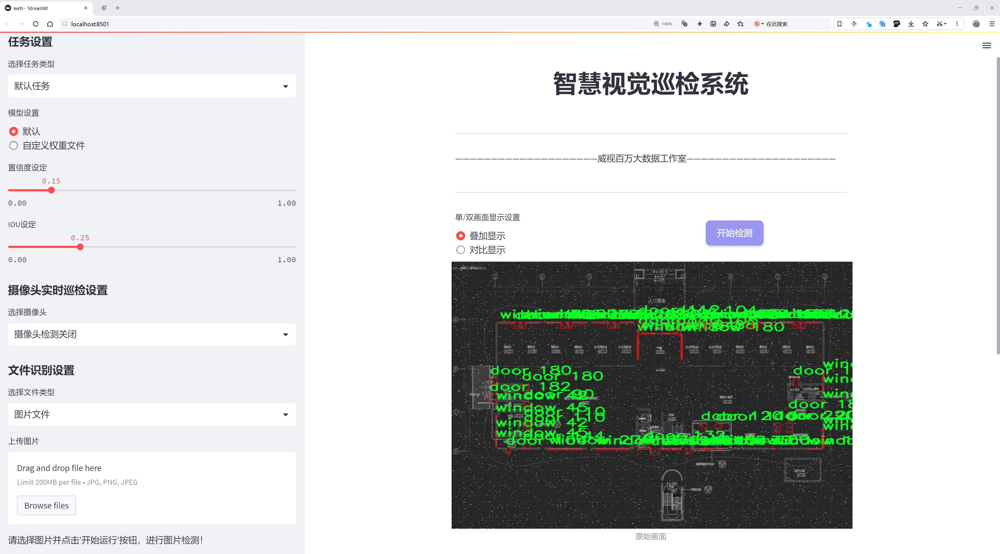
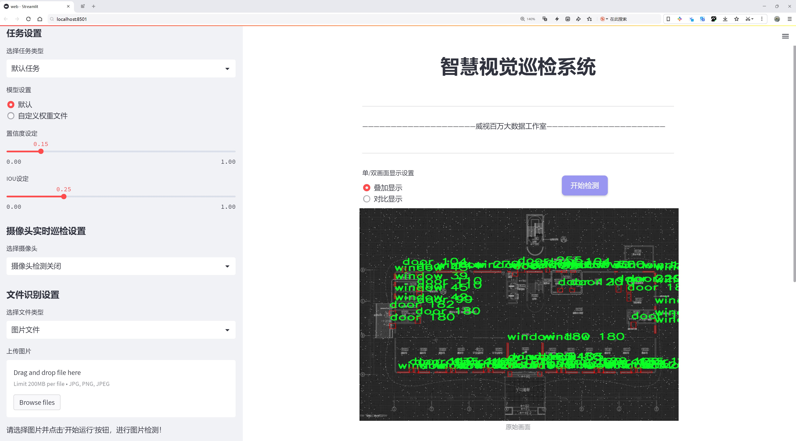
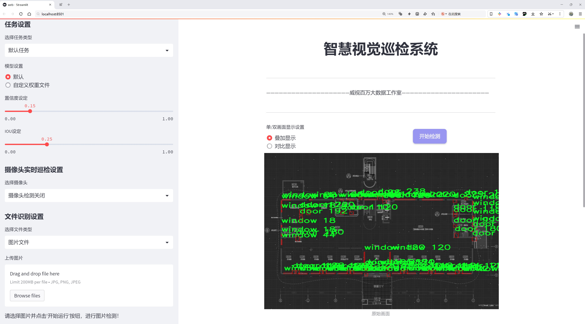
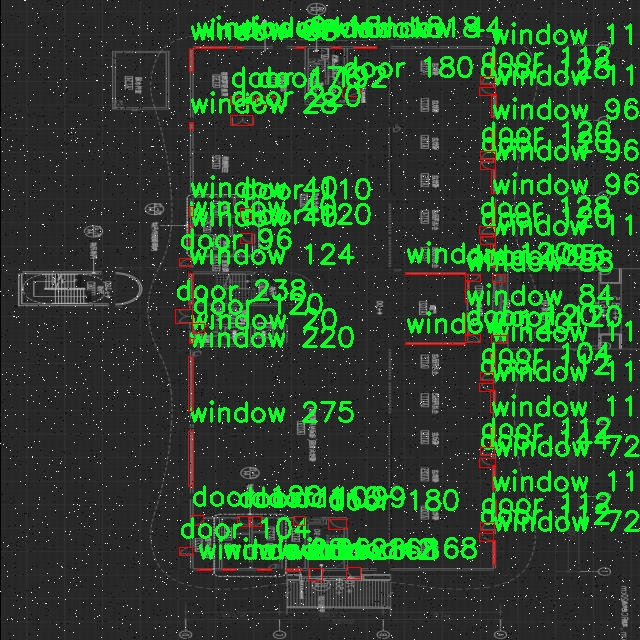
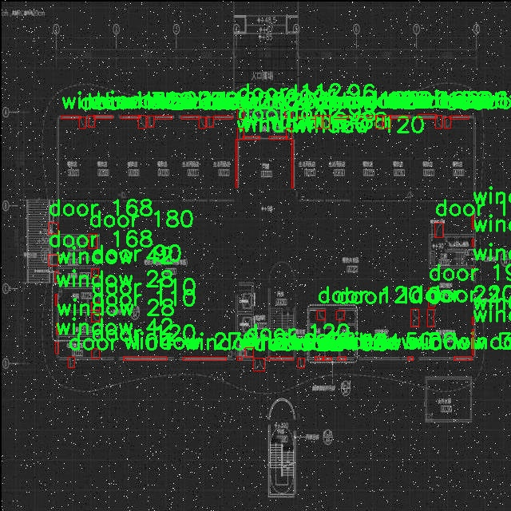
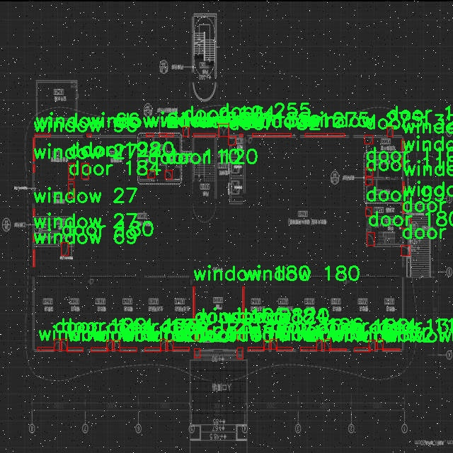
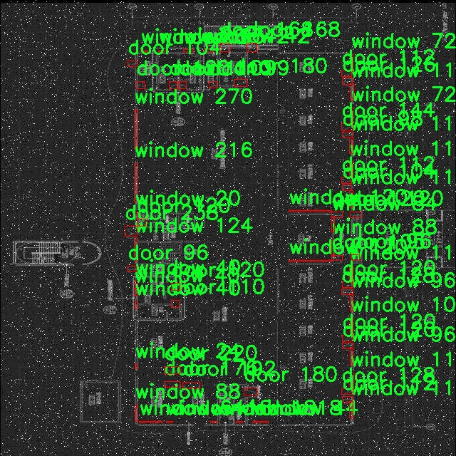

# 门窗对象检测系统源码分享
 # [一条龙教学YOLOV8标注好的数据集一键训练_70+全套改进创新点发刊_Web前端展示]

### 1.研究背景与意义

项目参考[AAAI Association for the Advancement of Artificial Intelligence](https://gitee.com/qunmasj/projects)

项目来源[AACV Association for the Advancement of Computer Vision](https://kdocs.cn/l/cszuIiCKVNis)

研究背景与意义

随着智能建筑和智慧城市的快速发展，门窗作为建筑物的重要组成部分，其智能化管理与监测逐渐受到重视。门窗不仅是建筑的基本功能单元，还是安全防护、节能环保的重要环节。传统的门窗管理方式往往依赖人工巡检，效率低下且容易出现遗漏，无法满足现代建筑对实时监控和管理的需求。因此，基于计算机视觉的门窗对象检测系统应运而生，成为提升门窗管理效率的重要手段。

近年来，深度学习技术的飞速发展为目标检测领域带来了革命性的变化。YOLO（You Only Look Once）系列模型以其高效的实时检测能力和较高的准确率，成为目标检测任务中的热门选择。YOLOv8作为该系列的最新版本，结合了更先进的网络结构和优化算法，能够在复杂环境中实现更为精准的目标识别。然而，尽管YOLOv8在通用目标检测任务中表现优异，但在特定领域的应用中，仍需针对性地进行改进和优化，以适应不同的检测需求。

本研究旨在基于改进YOLOv8模型，构建一个高效的门窗对象检测系统。我们使用的CAD对象窗口门数据集包含2107张图像，涵盖了门和窗两个类别。这一数据集不仅数量适中，而且涵盖了多种场景和光照条件，为模型的训练和测试提供了丰富的样本。通过对数据集的深入分析，我们可以识别出门窗对象在不同环境下的特征，从而为模型的改进提供依据。

在实际应用中，门窗对象检测系统可以广泛应用于建筑物的安全监控、节能管理、智能家居等多个领域。例如，在智能家居系统中，门窗检测可以与安防系统联动，实现对异常开关状态的实时报警；在建筑节能管理中，通过监测门窗的开关状态，可以有效控制室内温度，降低能耗。因此，研究基于改进YOLOv8的门窗对象检测系统，不仅具有重要的学术价值，还有着广泛的应用前景。

此外，随着数据隐私和安全问题的日益突出，门窗对象检测系统的研究也将推动相关技术在数据保护和隐私安全方面的探索。通过设计合理的检测算法和数据处理流程，可以在确保用户隐私的前提下，实现高效的门窗管理。

综上所述，基于改进YOLOv8的门窗对象检测系统的研究，不仅为目标检测技术的应用提供了新的思路，也为智能建筑的管理与监控提供了切实可行的解决方案。随着技术的不断进步和应用场景的拓展，未来的门窗对象检测系统将更加智能化、自动化，为人们的生活带来更多便利与安全保障。

### 2.图片演示







##### 注意：由于此博客编辑较早，上面“2.图片演示”和“3.视频演示”展示的系统图片或者视频可能为老版本，新版本在老版本的基础上升级如下：（实际效果以升级的新版本为准）

  （1）适配了YOLOV8的“目标检测”模型和“实例分割”模型，通过加载相应的权重（.pt）文件即可自适应加载模型。

  （2）支持“图片识别”、“视频识别”、“摄像头实时识别”三种识别模式。

  （3）支持“图片识别”、“视频识别”、“摄像头实时识别”三种识别结果保存导出，解决手动导出（容易卡顿出现爆内存）存在的问题，识别完自动保存结果并导出到tempDir中。

  （4）支持Web前端系统中的标题、背景图等自定义修改，后面提供修改教程。

  另外本项目提供训练的数据集和训练教程,暂不提供权重文件（best.pt）,需要您按照教程进行训练后实现图片演示和Web前端界面演示的效果。

### 3.视频演示

[3.1 视频演示](https://www.bilibili.com/video/BV1Kk2nYZEpH/)

### 4.数据集信息展示

##### 4.1 本项目数据集详细数据（类别数＆类别名）

nc: 2
names: ['door', 'window']


##### 4.2 本项目数据集信息介绍

数据集信息展示

在本研究中，我们使用了名为“CAD object window door”的数据集，以支持对门窗对象检测系统的改进，特别是针对YOLOv8模型的训练与优化。该数据集专注于两个主要类别：门（door）和窗（window），这两个类别在建筑物的结构设计和空间利用中具有重要意义。通过精确识别和分类这些对象，能够为智能建筑、自动化监控以及增强现实等应用提供强有力的支持。

“CAD object window door”数据集包含丰富的标注信息，旨在为深度学习模型提供高质量的训练样本。数据集中包含的门和窗的图像样本均经过精细标注，确保每个对象的边界框和类别标签的准确性。这种高质量的标注不仅有助于提高模型的检测精度，还能有效减少误检和漏检的情况，从而提升整体系统的可靠性和实用性。

在数据集的构建过程中，研究者们采用了多种不同的场景和视角，以确保模型能够在各种环境下进行有效的对象检测。数据集中包含的图像来源于不同的建筑类型，包括住宅、商业和工业建筑等，这样的多样性使得模型在面对实际应用时，能够具备更强的适应性和泛化能力。此外，数据集中的门和窗的样式、颜色、材质等特征也具有多样性，进一步增强了模型的学习能力。

在进行YOLOv8模型的训练时，我们将“CAD object window door”数据集作为主要的数据源。YOLOv8作为一种先进的目标检测算法，具有高效的实时检测能力和较低的计算复杂度，适合在资源受限的环境中运行。通过利用该数据集，我们可以针对门窗对象的特征进行深度学习，优化模型的检测性能，提升其在实际应用中的表现。

为了确保模型的训练效果，我们将数据集划分为训练集和验证集，通常采用80/20的比例进行划分。训练集用于模型的学习和参数调整，而验证集则用于评估模型的性能，确保其在未见数据上的泛化能力。通过不断迭代训练和验证，我们能够对模型进行精细调优，确保其在门窗对象检测任务中的高效性和准确性。

总之，“CAD object window door”数据集为我们提供了一个坚实的基础，以支持YOLOv8模型在门窗对象检测领域的研究与应用。通过对该数据集的深入分析和有效利用，我们期望能够显著提升目标检测系统的性能，为智能建筑及相关领域的进一步发展奠定基础。随着研究的深入，我们相信该数据集将为未来的研究提供更多的启示和方向，推动门窗对象检测技术的不断进步。










### 5.全套项目环境部署视频教程（零基础手把手教学）

[5.1 环境部署教程链接（零基础手把手教学）](https://www.ixigua.com/7404473917358506534?logTag=c807d0cbc21c0ef59de5)


[5.2 安装Python虚拟环境创建和依赖库安装视频教程链接（零基础手把手教学）](https://www.ixigua.com/7404474678003106304?logTag=1f1041108cd1f708b01a)

### 6.手把手YOLOV8训练视频教程（零基础小白有手就能学会）

[6.1 手把手YOLOV8训练视频教程（零基础小白有手就能学会）](https://www.ixigua.com/7404477157818401292?logTag=d31a2dfd1983c9668658)


按照上面的训练视频教程链接加载项目提供的数据集，运行train.py即可开始训练



     Epoch   gpu_mem       box       obj       cls    labels  img_size
     1/200     20.8G   0.01576   0.01955  0.007536        22      1280: 100%|██████████| 849/849 [14:42<00:00,  1.04s/it]
               Class     Images     Labels          P          R     mAP@.5 mAP@.5:.95: 100%|██████████| 213/213 [01:14<00:00,  2.87it/s]
                 all       3395      17314      0.994      0.957      0.0957      0.0843

     Epoch   gpu_mem       box       obj       cls    labels  img_size
     2/200     20.8G   0.01578   0.01923  0.007006        22      1280: 100%|██████████| 849/849 [14:44<00:00,  1.04s/it]
               Class     Images     Labels          P          R     mAP@.5 mAP@.5:.95: 100%|██████████| 213/213 [01:12<00:00,  2.95it/s]
                 all       3395      17314      0.996      0.956      0.0957      0.0845

     Epoch   gpu_mem       box       obj       cls    labels  img_size
     3/200     20.8G   0.01561    0.0191  0.006895        27      1280: 100%|██████████| 849/849 [10:56<00:00,  1.29it/s]
               Class     Images     Labels          P          R     mAP@.5 mAP@.5:.95: 100%|███████   | 187/213 [00:52<00:00,  4.04it/s]
                 all       3395      17314      0.996      0.957      0.0957      0.0845


### 7.70+种全套YOLOV8创新点代码加载调参视频教程（一键加载写好的改进模型的配置文件）

[7.1 70+种全套YOLOV8创新点代码加载调参视频教程（一键加载写好的改进模型的配置文件）](https://www.ixigua.com/7404478314661806627?logTag=29066f8288e3f4eea3a4)

### 8.70+种全套YOLOV8创新点原理讲解（非科班也可以轻松写刊发刊，V10版本正在科研待更新）

#### 由于篇幅限制，每个创新点的具体原理讲解就不一一展开，具体见下列网址中的创新点对应子项目的技术原理博客网址【Blog】：


[8.1 70+种全套YOLOV8创新点原理讲解链接](https://gitee.com/qunmasj/good)

#### 部分改进原理讲解(完整的改进原理见上图和技术博客链接)
### YOLOv8简介
YOLO（You Only Look Once）是一种流行的对象检测和图像分割模型，由华盛顿大学的Joseph Redmon和Ali Farhadi开发。YOLO于2015年推出，以其高速度和高精度迅速走红。

YOLOv2于2016年发布，通过合并批处理规范化、锚盒和维度集群来改进原始模型
2018年推出的YOLOv3使用更高效的骨干网络、多个锚点和空间金字塔池进一步增强了该模型的性能
YOLOv4于2020年发布，引入了Mosaic数据增强、新的无锚检测头和新的丢失功能等创新
YOLOv5进一步提高了模型的性能，并添加了超参数优化、集成实验跟踪和自动导出到流行导出格式等新功能
YOLOv6于2022年由美团开源，目前正在该公司的许多自动配送机器人中使用
YOLOv7在COCO关键点数据集上添加了额外的任务，如姿态估计
YOLOv8是Ultralytics公司推出的YOLO的最新版本。作为一款尖端、最先进的（SOTA）车型，YOLOv8在之前版本的成功基础上，引入了新的功能和改进，以增强性能、灵活性和效率。YOLOv8支持全方位的视觉AI任务，包括检测、分割、姿态估计、跟踪和分类。这种多功能性允许用户在不同的应用程序和域中利用YOLOv8的功能
#### YOLOv8的新特性与可用模型

Ultralytics 并没有直接将开源库命名为 YOLOv8，而是直接使用 ultralytics 这个词，原因是 ultralytics 将这个库定位为算法框架，而非某一个特定算法，一个主要特点是可扩展性。其希望这个库不仅仅能够用于 YOLO 系列模型，而是能够支持非 YOLO 模型以及分类分割姿态估计等各类任务。总而言之，ultralytics 开源库的两个主要优点是：

融合众多当前 SOTA 技术于一体
未来将支持其他 YOLO 系列以及 YOLO 之外的更多算法
Ultralytics为YOLO模型发布了一个全新的存储库。它被构建为 用于训练对象检测、实例分割和图像分类模型的统一框架。

提供了一个全新的 SOTA 模型，包括 P5 640 和 P6 1280 分辨率的目标检测网络和基于 YOLACT 的实例分割模型。和 YOLOv5 一样，基于缩放系数也提供了 N/S/M/L/X 尺度的不同大小模型，用于满足不同场景需求
骨干网络和 Neck 部分可能参考了 YOLOv7 ELAN 设计思想，将 YOLOv5 的 C3 结构换成了梯度流更丰富的 C2f 结构，并对不同尺度模型调整了不同的通道数，属于对模型结构精心微调，不再是无脑一套参数应用所有模型，大幅提升了模型性能。不过这个 C2f 模块中存在 Split 等操作对特定硬件部署没有之前那么友好了
Head 部分相比 YOLOv5 改动较大，换成了目前主流的解耦头结构，将分类和检测头分离，同时也从 Anchor-Based 换成了 Anchor-Free
Loss 计算方面采用了 TaskAlignedAssigner 正样本分配策略，并引入了 Distribution Focal Loss
训练的数据增强部分引入了 YOLOX 中的最后 10 epoch 关闭 Mosiac 增强的操作，可以有效地提升精度
YOLOv8 还高效灵活地支持多种导出格式，并且该模型可以在 CPU 和 GPU 上运行。YOLOv8 模型的每个类别中有五个模型用于检测、分割和分类。YOLOv8 Nano 是最快和最小的，而 YOLOv8 Extra Large (YOLOv8x) 是其中最准确但最慢的。


### FocalModulation模型的基本原理
参考该博客，Focal Modulation Networks（FocalNets）的基本原理是替换自注意力（Self-Attention）模块，使用焦点调制（focal modulation）机制来捕捉图像中的长距离依赖和上下文信息。下图是自注意力和焦点调制两种方法的对比。


自注意力要求对每个查询令牌（Query Token）与其他令牌进行复杂的查询-键（Query-Key）交互和查询-值（Query-Value）聚合，以计算注意力分数并捕捉上下文。而焦点调制则先将空间上下文以不同粒度聚合到调制器中，然后以查询依赖的方式将这些调制器注入到查询令牌中。焦点调制简化了交互和聚合操作，使其更轻量级。在图中，自注意力部分使用红色虚线表示查询-键交互和黄色虚线表示查询-值聚合，而焦点调制部分则用蓝色表示调制器聚合和黄色表示查询-调制器交互。 

FocalModulation模型通过以下步骤实现：

1. 焦点上下文化：用深度卷积层堆叠来编码不同范围的视觉上下文。


2. 门控聚合：通过门控机制，选择性地将上下文信息聚合到每个查询令牌的调制器中。


3. 逐元素仿射变换：将聚合后的调制器通过仿射变换注入到每个查询令牌中。

下面来分别介绍这三个机制->

#### 焦点上下文化
焦点上下文化（Focal Contextualization）是焦点调制（Focal Modulation）的一个组成部分。焦点上下文化使用一系列深度卷积层（depth-wise convolutional layers）来编码不同范围内的视觉上下文信息。这些层可以捕捉从近处到远处的视觉特征，从而允许网络在不同层次上理解图像内容。通过这种方式，网络能够在聚合上下文信息时保持对局部细节的敏感性，并增强对全局结构的认识。


​

这张图详细比较了自注意力（Self-Attention, SA）和焦点调制（Focal Modulation）的机制，并特别展示了焦点调制中的上下文聚合过程。左侧的图展示了自注意力模型如何通过键（k）和查询（q）之间的交互，以及随后的聚合来生成输出。而中间和右侧的图说明了焦点调制如何通过层级化的上下文聚合和门控聚合过程替代自注意力模型的这一过程。在焦点调制中，输入首先通过轻量级线性层进行处理，然后通过层级化的上下文化模块和门控机制来选择性地聚合信息，最终通过调制器与查询（q）进行交互以生成输出。

#### 门控聚合
在Focal Modulation Networks（FocalNets）中的 "门控聚合"（Gated Aggregation）是关键组件之一，这一过程涉及使用门控机制来选择性地聚合上下文信息。以下是这个过程的详细分析：

1. 什么是门控机制？
门控机制在深度学习中常用于控制信息流。它通常用于决定哪些信息应该被传递，哪些应该被阻断。在循环神经网络（RNN）中，特别是在长短期记忆网络（LSTM）和门控循环单元（GRU）中，门控机制用于调节信息在时间序列数据中的流动。

2. 门控聚合的目的
在FocalNets中，门控聚合的目的是为每个查询令牌（即处理中的数据单元）选择性地聚合上下文信息。这意味着网络能够决定哪些特定的上下文信息对于当前处理的查询令牌是重要的，从而专注于那些最相关的信息。

3. 如何实现门控聚合？
实现门控聚合可能涉及一系列计算步骤，其中包括：

计算上下文信息：这可能涉及使用深度卷积层（如文中提到的）对输入图像的不同区域进行编码，以捕捉从局部到全局的视觉上下文。
门控操作：这一步骤涉及到一个决策过程，根据当前查询令牌的特征来决定哪些上下文信息是相关的。这可能通过一个学习到的权重（门）来实现，该权重决定了不同上下文信息的重要性。
信息聚合：最后，根据门控操作的结果，选择性地聚合上下文信息到一个调制器中。这个调制器随后被用于调整或“调制”查询令牌的表示。
4. 门控聚合的好处
通过门控聚合，FocalNets能够更有效地聚焦于对当前任务最关键的信息。这种方法提高了模型的效率和性能，因为它减少了不必要信息的处理，同时增强了对关键特征的关注。在视觉任务中，这可能意味着更好的目标检测和图像分类性能，特别是在复杂或多变的视觉环境中。

总结：门控聚合是FocalNets的一个核心组成部分，它通过选择性地集中处理重要的上下文信息来提升网络的效率和性能。

#### 逐元素仿射变换
在Focal Modulation Networks（FocalNets）中的第三个关键组件是逐元素仿射变换，这个步骤涉及将通过门控聚合得到的调制器注入到每个查询令牌中。以下是该过程的详细分析：

1. 仿射变换的基本概念：
仿射变换是一种线性变换，用于对数据进行缩放、旋转、平移和倾斜等操作。在深度学习中，逐元素的仿射变换通常指的是对每个元素进行线性变换，这种变换可以被描述为y = ax + b，其中x是输入，y是输出，a和b是变换的参数。

2. 逐元素仿射变换的作用：
在FocalNets中，逐元素仿射变换的作用是将聚合后的调制器信息注入到每个查询令牌中。这个步骤对于整合上下文信息和查询令牌的原始特征非常重要。通过这种方式，调制器所包含的上下文信息可以直接影响查询令牌的表示。

3. 执行仿射变换：
执行这一步骤时，聚合后的调制器对每个查询令牌进行逐元素的仿射变换。在实践中，这可能意味着对查询令牌的每个特征应用调制器中的相应权重（a）和偏差（b）。这样，调制器中的每个元素都直接对应于查询令牌的一个特征，通过调整这些特征来改变其表达。

4. 仿射变换的效果：
通过逐元素仿射变换，模型能够更细致地调整每个查询令牌的特征，根据上下文信息来增强或抑制某些特征。这种精细的调整机制允许网络更好地适应复杂的视觉场景，提高对细节的捕捉能力，从而提升了模型在各种视觉任务中的性能，如目标检测和图像分类。

总结：逐元素仿射变换它使得模型能够利用上下文信息来有效地调整查询令牌，增强了模型对关键视觉特征的捕捉和表达能力。


### 9.系统功能展示（检测对象为举例，实际内容以本项目数据集为准）

图9.1.系统支持检测结果表格显示

  图9.2.系统支持置信度和IOU阈值手动调节

  图9.3.系统支持自定义加载权重文件best.pt(需要你通过步骤5中训练获得)

  图9.4.系统支持摄像头实时识别

  图9.5.系统支持图片识别

  图9.6.系统支持视频识别

  图9.7.系统支持识别结果文件自动保存

  图9.8.系统支持Excel导出检测结果数据


### 10.原始YOLOV8算法原理

原始YOLOv8算法原理

YOLOv8是目标检测领域中的一项重要进展，作为YOLO系列的最新版本，它在YOLOv5的基础上进行了多项改进，旨在提升检测精度和速度。YOLOv8的设计理念是将目标检测任务转化为一个回归问题，通过一个单一的神经网络模型同时预测目标的位置和类别。这种方法使得YOLOv8能够在保持高效性的同时，提供更为准确的检测结果。

YOLOv8的网络结构主要由四个部分组成：输入端、主干网络、颈部网络和头部网络。输入端采用了马赛克数据增强技术，这种技术通过将多张图像拼接在一起，增强了模型的鲁棒性和泛化能力。然而，YOLOv8在训练的最后10个epoch中停止使用马赛克数据增强，以避免对数据真实分布的破坏，从而使模型能够更好地学习到有效的信息。

在主干网络部分，YOLOv8对传统的C3模块进行了替换，采用了C2f模块。C2f模块在YOLOv7的ELAN结构基础上进行了改进，增加了更多的跳层连接，这种设计使得模型能够获得更丰富的梯度流信息，进而提升特征表示能力。同时，YOLOv8依然保留了SPPF（Spatial Pyramid Pooling Fusion）模块，尽管其效果不变，但在执行时间上得到了显著的减少。

颈部网络同样采用了C2f模块的结构，并且删除了两处上采样之前的卷积连接层。这一设计使得特征融合更加高效，能够更好地处理不同尺度的目标。通过这种方式，YOLOv8在特征提取和融合的过程中，能够保持较高的精度和速度。

头部网络是YOLOv8的一大亮点，它采用了解耦头的设计思路，将分类和定位任务分为两个独立的分支。这种解耦的方式使得模型在处理分类和定位时，能够更加专注于各自的任务，进而提高了收敛速度和预测精度。分类任务更注重于分析特征图中提取到的特征与已有类别的相似性，而定位任务则关注边界框与真实框的位置关系。通过这种方式，YOLOv8能够更有效地处理复杂场景下的目标检测问题。

此外，YOLOv8引入了无锚框结构，直接预测目标的中心位置，并采用了任务对齐学习（Task Alignment Learning，TAL）来区分正负样本。这一创新的设计使得模型在进行目标检测时，不再依赖于预定义的锚框，从而减少了锚框预测的数量，加速了非最大抑制（Non-Maximum Suppression，NMS）过程。这种Anchor-Free的目标检测方法使得YOLOv8在处理不同尺度和形状的目标时，表现出更好的灵活性和准确性。

在损失计算方面，YOLOv8结合了分类和回归两个分支的损失函数。分类分支采用了二元交叉熵损失（Binary Cross Entropy Loss），而回归分支则结合了分布焦点损失（Distribution Focal Loss）和完全交并比损失（Complete Intersection over Union Loss），以提升模型对边界框预测的精准性。这种多元化的损失计算方式，使得YOLOv8在训练过程中能够更好地平衡分类和定位的任务，提高了整体的检测性能。

YOLOv8在检测结果上也取得了显著的成果。在COCO数据集上的实验表明，YOLOv8在相同尺寸下的模型中，参数量没有显著增加的前提下，取得了比其他模型更好的精度。此外，YOLOv8在推理速度上也表现出色，能够满足实时检测的需求，这对于许多应用场景，尤其是需要快速响应的任务来说，具有重要的意义。

综合来看，YOLOv8的设计充分考虑了目标检测任务的实时性和准确性需求。通过对网络结构的优化和创新，YOLOv8在保证高效性的同时，提升了模型的检测精度，使其在目标检测领域中具有广泛的应用价值。尽管YOLOv8是一个相对较新的模型，但其在性能上的优势，使得它在未来的研究和应用中，具有极大的潜力和发展空间。随着对YOLOv8的深入研究和探索，预计将会有更多的改进和应用场景被开发出来，进一步推动目标检测技术的发展。


### 11.项目核心源码讲解（再也不用担心看不懂代码逻辑）

#### 11.1 code\ultralytics\models\yolo\detect\train.py

以下是经过精简和注释的核心代码部分，保留了最重要的功能，并对每个方法进行了详细的中文注释：

```python
# 导入必要的库
import math
import random
import numpy as np
import torch.nn as nn
from ultralytics.data import build_dataloader, build_yolo_dataset
from ultralytics.engine.trainer import BaseTrainer
from ultralytics.models import yolo
from ultralytics.nn.tasks import DetectionModel
from ultralytics.utils import LOGGER, RANK
from ultralytics.utils.torch_utils import de_parallel, torch_distributed_zero_first

class DetectionTrainer(BaseTrainer):
    """
    基于检测模型的训练类，继承自BaseTrainer类。
    """

    def build_dataset(self, img_path, mode="train", batch=None):
        """
        构建YOLO数据集。

        参数:
            img_path (str): 包含图像的文件夹路径。
            mode (str): 模式，`train`或`val`，用户可以为每种模式自定义不同的增强。
            batch (int, optional): 批量大小，适用于`rect`模式。默认为None。
        """
        gs = max(int(de_parallel(self.model).stride.max() if self.model else 0), 32)
        return build_yolo_dataset(self.args, img_path, batch, self.data, mode=mode, rect=mode == "val", stride=gs)

    def get_dataloader(self, dataset_path, batch_size=16, rank=0, mode="train"):
        """构造并返回数据加载器。"""
        assert mode in ["train", "val"]
        with torch_distributed_zero_first(rank):  # DDP模式下只初始化一次数据集
            dataset = self.build_dataset(dataset_path, mode, batch_size)
        shuffle = mode == "train"  # 训练模式下打乱数据
        workers = self.args.workers if mode == "train" else self.args.workers * 2
        return build_dataloader(dataset, batch_size, workers, shuffle, rank)  # 返回数据加载器

    def preprocess_batch(self, batch):
        """对图像批次进行预处理，包括缩放和转换为浮点数。"""
        batch["img"] = batch["img"].to(self.device, non_blocking=True).float() / 255  # 归一化图像
        if self.args.multi_scale:  # 如果启用多尺度
            imgs = batch["img"]
            sz = (
                random.randrange(self.args.imgsz * 0.5, self.args.imgsz * 1.5 + self.stride)
                // self.stride
                * self.stride
            )  # 随机选择图像大小
            sf = sz / max(imgs.shape[2:])  # 计算缩放因子
            if sf != 1:
                ns = [
                    math.ceil(x * sf / self.stride) * self.stride for x in imgs.shape[2:]
                ]  # 计算新的形状
                imgs = nn.functional.interpolate(imgs, size=ns, mode="bilinear", align_corners=False)  # 调整图像大小
            batch["img"] = imgs
        return batch

    def get_model(self, cfg=None, weights=None, verbose=True):
        """返回YOLO检测模型。"""
        model = DetectionModel(cfg, nc=self.data["nc"], verbose=verbose and RANK == -1)
        if weights:
            model.load(weights)  # 加载模型权重
        return model

    def plot_training_samples(self, batch, ni):
        """绘制训练样本及其注释。"""
        plot_images(
            images=batch["img"],
            batch_idx=batch["batch_idx"],
            cls=batch["cls"].squeeze(-1),
            bboxes=batch["bboxes"],
            paths=batch["im_file"],
            fname=self.save_dir / f"train_batch{ni}.jpg",
            on_plot=self.on_plot,
        )

    def plot_metrics(self):
        """从CSV文件中绘制指标。"""
        plot_results(file=self.csv, on_plot=self.on_plot)  # 保存结果图
```

### 代码说明：
1. **类定义**：`DetectionTrainer` 继承自 `BaseTrainer`，用于处理YOLO模型的训练。
2. **数据集构建**：`build_dataset` 方法根据输入路径和模式构建YOLO数据集。
3. **数据加载器**：`get_dataloader` 方法创建数据加载器，支持分布式训练。
4. **批处理预处理**：`preprocess_batch` 方法对图像批次进行归一化和缩放处理。
5. **模型获取**：`get_model` 方法返回YOLO检测模型，并可选择加载预训练权重。
6. **绘图功能**：`plot_training_samples` 和 `plot_metrics` 方法用于可视化训练样本和训练指标。

以上代码保留了YOLO训练的核心功能，并添加了详细的中文注释，便于理解每个部分的作用。

该文件是Ultralytics YOLO模型的训练模块，主要用于实现目标检测任务的训练过程。文件中定义了一个名为`DetectionTrainer`的类，它继承自`BaseTrainer`类，专门用于基于YOLO模型的训练。

在`DetectionTrainer`类中，首先定义了一个`build_dataset`方法，用于构建YOLO数据集。该方法接收图像路径、模式（训练或验证）和批次大小作为参数。它会根据模型的步幅（stride）来确定数据集的构建方式，并调用`build_yolo_dataset`函数来生成数据集。

接下来，`get_dataloader`方法用于构建和返回数据加载器。该方法确保在分布式训练中只初始化一次数据集，并根据模式设置是否打乱数据顺序。它还会根据训练或验证模式调整工作线程的数量。

`preprocess_batch`方法负责对图像批次进行预处理，包括将图像缩放到合适的大小并转换为浮点数。它支持多尺度训练，随机选择图像大小并进行插值处理，以确保输入图像的尺寸符合模型要求。

`set_model_attributes`方法用于设置模型的属性，包括类别数量和类别名称。这些属性会在模型训练过程中使用，以确保模型能够正确识别和分类目标。

`get_model`方法返回一个YOLO检测模型的实例，可以选择加载预训练权重。`get_validator`方法则返回一个用于模型验证的`DetectionValidator`实例，负责在训练过程中评估模型的性能。

`label_loss_items`方法用于返回带有标签的训练损失项字典，这在目标检测和分割任务中是必要的。它会将损失项转换为浮点数并进行格式化。

`progress_string`方法返回一个格式化的字符串，显示训练进度，包括当前的epoch、GPU内存使用情况、损失值、实例数量和图像大小等信息。

`plot_training_samples`方法用于绘制训练样本及其注释，便于可视化训练过程中的数据。`plot_metrics`方法则从CSV文件中绘制训练过程中的指标，并保存结果图像。最后，`plot_training_labels`方法用于创建带标签的训练图，展示训练数据集中目标的边界框和类别信息。

整体来看，该文件实现了YOLO模型训练的各个环节，包括数据集构建、数据加载、模型设置、损失计算和结果可视化，为目标检测任务提供了完整的训练框架。

#### 11.2 code\web.py

以下是代码中最核心的部分，并附上详细的中文注释：

```python
import cv2
import numpy as np
from PIL import ImageFont, ImageDraw, Image

def draw_with_chinese(image, text, position, font_size=20, color=(255, 0, 0)):
    """
    在OpenCV图像上绘制中文文字
    """
    # 将图像从 OpenCV 格式（BGR）转换为 PIL 格式（RGB）
    image_pil = Image.fromarray(cv2.cvtColor(image, cv2.COLOR_BGR2RGB))
    draw = ImageDraw.Draw(image_pil)
    # 使用指定的字体
    font = ImageFont.truetype("simsun.ttc", font_size, encoding="unic")
    draw.text(position, text, font=font, fill=color)
    # 将图像从 PIL 格式（RGB）转换回 OpenCV 格式（BGR）
    return cv2.cvtColor(np.array(image_pil), cv2.COLOR_RGB2BGR)

def adjust_parameter(image_size, base_size=1000):
    """
    计算自适应参数，基于图片的最大尺寸
    """
    max_size = max(image_size)  # 获取图像的最大尺寸
    return max_size / base_size  # 返回自适应参数

def draw_detections(image, info, alpha=0.2):
    """
    在图像上绘制检测结果，包括边界框和标签
    """
    name, bbox, conf, cls_id, mask = info['class_name'], info['bbox'], info['score'], info['class_id'], info['mask']
    adjust_param = adjust_parameter(image.shape[:2])  # 获取自适应参数
    if mask is None:
        # 当 mask 为 None，计算 bbox 的矩形框面积
        x1, y1, x2, y2 = bbox
        aim_frame_area = (x2 - x1) * (y2 - y1)

        # 绘制矩形框
        cv2.rectangle(image, (x1, y1), (x2, y2), color=(0, 0, 255), thickness=int(3*adjust_param))

        # 绘制标签和面积
        label_area = f"{name} {int(aim_frame_area)}"
        image = draw_with_chinese(image, label_area, (x1, y1 - int(30 * adjust_param)), font_size=int(35*adjust_param))

    else:
        # 当 mask 不为 None，计算点集围成的多边形面积
        mask_points = np.concatenate(mask)  # 假设 mask 是一个列表，内含一个 numpy 数组
        aim_frame_area = calculate_polygon_area(mask_points)
        try:
            # 绘制mask的轮廓
            cv2.drawContours(image, [mask_points.astype(np.int32)], -1, (0, 0, 255), thickness=int(3*adjust_param))

            # 绘制标签和面积
            label_area = f"{name}  {int(aim_frame_area)}"
            x, y = np.min(mask_points, axis=0).astype(int)
            image = draw_with_chinese(image, label_area, (x, y - int(30 * adjust_param)), font_size=int(35*adjust_param))
        except:
            pass

    return image, aim_frame_area

def calculate_polygon_area(points):
    """
    计算多边形的面积，输入应为一个 Nx2 的numpy数组，表示多边形的顶点坐标
    """
    if len(points) < 3:  # 多边形至少需要3个顶点
        return 0
    return cv2.contourArea(points)  # 使用OpenCV计算多边形面积

class Detection_UI:
    """
    检测系统类。
    """
    def __init__(self):
        """
        初始化检测系统的参数。
        """
        # 初始化模型、阈值和摄像头等相关参数
        self.model_type = None
        self.conf_threshold = 0.15  # 默认置信度阈值
        self.iou_threshold = 0.5  # 默认IOU阈值
        self.selected_camera = None
        self.uploaded_file = None
        self.uploaded_video = None

        # 初始化日志和结果记录
        self.logTable = LogTable()  # 创建日志表格实例

    def process_camera_or_file(self):
        """
        处理摄像头或文件输入。
        """
        if self.selected_camera:
            # 处理摄像头输入
            cap = cv2.VideoCapture(self.selected_camera)
            while cap.isOpened():
                ret, frame = cap.read()
                if ret:
                    image, detInfo, _ = self.frame_process(frame)
                    # 显示处理后的图像
                    cv2.imshow("Detection", image)
                    if cv2.waitKey(1) & 0xFF == ord('q'):
                        break
            cap.release()
        elif self.uploaded_file:
            # 处理上传的文件
            image = cv2.imread(self.uploaded_file)
            image, detInfo, _ = self.frame_process(image)
            cv2.imshow("Detection", image)
            cv2.waitKey(0)

    def frame_process(self, image):
        """
        处理并预测单个图像帧的内容。
        """
        pre_img = self.model.preprocess(image)  # 对图像进行预处理
        pred = self.model.predict(pre_img)  # 使用模型进行预测
        detInfo = self.model.postprocess(pred)  # 后处理预测结果

        # 绘制检测结果
        for info in detInfo:
            image, _ = draw_detections(image, info)

        return image, detInfo, None

# 实例化并运行应用
if __name__ == "__main__":
    app = Detection_UI()
    app.process_camera_or_file()  # 运行摄像头或文件处理
```

### 代码核心部分解释：
1. **draw_with_chinese**: 该函数用于在图像上绘制中文文字，使用PIL库处理中文字体的显示。
2. **adjust_parameter**: 计算自适应参数，以便根据图像大小调整绘制的元素。
3. **draw_detections**: 在图像上绘制检测结果，包括边界框和标签。根据是否有mask来选择绘制方式。
4. **calculate_polygon_area**: 计算多边形的面积，确保至少有三个顶点。
5. **Detection_UI类**: 该类是整个检测系统的核心，负责初始化参数、处理摄像头或文件输入，以及处理每一帧图像的检测逻辑。

这个程序文件 `code\web.py` 是一个基于 Streamlit 的图像和视频检测应用，主要用于实时监控和目标检测。程序的核心功能包括从摄像头或上传的文件中读取图像，使用深度学习模型进行目标检测，并将检测结果可视化展示。

首先，程序导入了必要的库，包括用于图像处理的 OpenCV、NumPy、PIL 以及 Streamlit 用于构建用户界面的模块。此外，还引入了一些自定义模块和工具函数，如日志记录、模型加载和结果处理等。

在程序中定义了多个函数和一个类 `Detection_UI`。函数 `draw_with_chinese` 用于在图像上绘制中文文本，`adjust_parameter` 用于根据图像大小调整绘制参数，`draw_detections` 则负责在图像上绘制检测框和标签。`calculate_polygon_area` 用于计算多边形的面积，`format_time` 用于格式化时间，`save_chinese_image` 用于保存带有中文路径的图像。

`Detection_UI` 类是程序的核心，负责初始化应用的各项参数和界面。构造函数中初始化了类别标签、颜色、页面标题、检测相关参数、摄像头和文件变量、检测结果变量等。它还负责设置页面布局和侧边栏，用户可以在侧边栏中选择模型类型、摄像头、文件类型等。

在 `setup_sidebar` 方法中，程序提供了用户选择模型、设置置信度和 IOU 阈值的选项，并允许用户上传图片或视频文件。`process_camera_or_file` 方法则根据用户的选择处理摄像头或文件输入，捕获视频流或读取上传的文件，进行目标检测并显示结果。

`frame_process` 方法用于处理单个图像帧，调用模型进行预测，并绘制检测结果。程序使用 `draw_detections` 函数在图像上绘制检测框和标签，并将结果记录到日志中。

最后，程序通过 `setupMainWindow` 方法设置主窗口的布局，创建显示模式选择、进度条、结果表格等组件，并提供开始检测和导出结果的按钮。用户可以通过点击按钮启动检测流程，实时查看检测结果。

整体而言，这个程序实现了一个功能丰富的目标检测系统，用户可以通过简单的界面进行设置和操作，实时监控和分析图像或视频中的目标。

#### 11.3 ui.py

以下是保留的核心代码部分，并附上详细的中文注释：

```python
import sys
import subprocess

def run_script(script_path):
    """
    使用当前 Python 环境运行指定的脚本。

    Args:
        script_path (str): 要运行的脚本路径

    Returns:
        None
    """
    # 获取当前 Python 解释器的路径
    python_path = sys.executable

    # 构建运行命令，使用 streamlit 运行指定的脚本
    command = f'"{python_path}" -m streamlit run "{script_path}"'

    # 执行命令
    result = subprocess.run(command, shell=True)
    # 检查命令执行结果，如果返回码不为0，则表示出错
    if result.returncode != 0:
        print("脚本运行出错。")

# 主程序入口
if __name__ == "__main__":
    # 指定要运行的脚本路径
    script_path = "web.py"  # 这里可以替换为实际的脚本路径

    # 调用函数运行脚本
    run_script(script_path)
```

### 代码注释说明：
1. **导入模块**：
   - `sys`：用于访问与 Python 解释器紧密相关的变量和函数。
   - `subprocess`：用于创建新进程、连接到它们的输入/输出/错误管道，并获得返回码。

2. **`run_script` 函数**：
   - 该函数接受一个脚本路径作为参数，并使用当前 Python 环境来运行该脚本。
   - 使用 `sys.executable` 获取当前 Python 解释器的路径，以确保使用正确的 Python 环境。
   - 构建一个命令字符串，使用 `streamlit` 模块来运行指定的脚本。
   - 使用 `subprocess.run` 执行构建的命令，并检查返回码以确定脚本是否成功运行。

3. **主程序入口**：
   - 使用 `if __name__ == "__main__":` 确保只有在直接运行该脚本时才会执行以下代码。
   - 指定要运行的脚本路径（这里为 `web.py`），可以根据需要进行修改。
   - 调用 `run_script` 函数来执行指定的脚本。

这个程序文件名为 `ui.py`，其主要功能是使用当前的 Python 环境来运行一个指定的脚本，具体是一个名为 `web.py` 的文件。程序首先导入了必要的模块，包括 `sys`、`os` 和 `subprocess`，这些模块分别用于访问系统参数、操作系统功能和执行外部命令。

在 `run_script` 函数中，首先定义了一个参数 `script_path`，用于接收要运行的脚本的路径。函数内部通过 `sys.executable` 获取当前 Python 解释器的路径，这样可以确保使用的是当前环境中的 Python 版本。接着，构建了一个命令字符串，该命令用于调用 `streamlit` 模块来运行指定的脚本。这里使用了 `subprocess.run` 方法来执行这个命令，并且设置 `shell=True` 以便在 shell 中运行。

如果脚本运行成功，`result.returncode` 将为 0；如果出现错误，则会打印出“脚本运行出错”的提示信息。

在文件的最后部分，使用 `if __name__ == "__main__":` 语句来确保当该文件作为主程序运行时才会执行下面的代码。此处指定了要运行的脚本路径为 `web.py`，并调用 `run_script` 函数来执行这个脚本。

整体来看，这个程序的目的是为方便用户在当前 Python 环境中启动一个 Streamlit 应用，通过调用外部脚本来实现特定的功能。

#### 11.4 train.py

以下是经过简化并添加详细中文注释的核心代码部分：

```python
import random
import numpy as np
import torch.nn as nn
from ultralytics.data import build_dataloader, build_yolo_dataset
from ultralytics.engine.trainer import BaseTrainer
from ultralytics.models import yolo
from ultralytics.nn.tasks import DetectionModel
from ultralytics.utils import LOGGER, RANK
from ultralytics.utils.torch_utils import de_parallel, torch_distributed_zero_first

class DetectionTrainer(BaseTrainer):
    """
    基于检测模型的训练类，继承自BaseTrainer类。
    示例用法：
        trainer = DetectionTrainer(overrides={'model': 'yolov8n.pt', 'data': 'coco8.yaml', 'epochs': 3})
        trainer.train()
    """

    def build_dataset(self, img_path, mode="train", batch=None):
        """
        构建YOLO数据集。

        参数:
            img_path (str): 包含图像的文件夹路径。
            mode (str): 模式，可以是'train'或'val'，用户可以为每种模式自定义不同的数据增强。
            batch (int, optional): 批次大小，适用于'rect'模式。默认为None。
        """
        gs = max(int(de_parallel(self.model).stride.max() if self.model else 0), 32)  # 获取模型的最大步幅
        return build_yolo_dataset(self.args, img_path, batch, self.data, mode=mode, rect=mode == "val", stride=gs)

    def get_dataloader(self, dataset_path, batch_size=16, rank=0, mode="train"):
        """构造并返回数据加载器。"""
        assert mode in ["train", "val"]  # 确保模式有效
        with torch_distributed_zero_first(rank):  # 在分布式训练中，确保数据集只初始化一次
            dataset = self.build_dataset(dataset_path, mode, batch_size)  # 构建数据集
        shuffle = mode == "train"  # 训练模式下打乱数据
        workers = self.args.workers if mode == "train" else self.args.workers * 2  # 设置工作线程数
        return build_dataloader(dataset, batch_size, workers, shuffle, rank)  # 返回数据加载器

    def preprocess_batch(self, batch):
        """对图像批次进行预处理，包括缩放和转换为浮点数。"""
        batch["img"] = batch["img"].to(self.device, non_blocking=True).float() / 255  # 将图像转换为浮点数并归一化
        if self.args.multi_scale:  # 如果启用多尺度
            imgs = batch["img"]
            sz = (
                random.randrange(self.args.imgsz * 0.5, self.args.imgsz * 1.5 + self.stride)
                // self.stride
                * self.stride
            )  # 随机选择新的尺寸
            sf = sz / max(imgs.shape[2:])  # 计算缩放因子
            if sf != 1:
                ns = [
                    math.ceil(x * sf / self.stride) * self.stride for x in imgs.shape[2:]
                ]  # 计算新的形状
                imgs = nn.functional.interpolate(imgs, size=ns, mode="bilinear", align_corners=False)  # 调整图像大小
            batch["img"] = imgs  # 更新批次图像
        return batch

    def get_model(self, cfg=None, weights=None, verbose=True):
        """返回YOLO检测模型。"""
        model = DetectionModel(cfg, nc=self.data["nc"], verbose=verbose and RANK == -1)  # 创建检测模型
        if weights:
            model.load(weights)  # 加载权重
        return model

    def plot_training_samples(self, batch, ni):
        """绘制带有注释的训练样本。"""
        plot_images(
            images=batch["img"],
            batch_idx=batch["batch_idx"],
            cls=batch["cls"].squeeze(-1),
            bboxes=batch["bboxes"],
            paths=batch["im_file"],
            fname=self.save_dir / f"train_batch{ni}.jpg",
            on_plot=self.on_plot,
        )
```

### 代码核心部分解释：
1. **DetectionTrainer类**：这是一个用于训练YOLO检测模型的类，继承自基础训练类`BaseTrainer`。
2. **build_dataset方法**：根据给定的图像路径和模式构建YOLO数据集，支持训练和验证模式。
3. **get_dataloader方法**：构造数据加载器，支持多线程和分布式训练。
4. **preprocess_batch方法**：对输入的图像批次进行预处理，包括归一化和多尺度调整。
5. **get_model方法**：返回一个YOLO检测模型，并可选择性地加载预训练权重。
6. **plot_training_samples方法**：绘制训练样本及其对应的注释，便于可视化训练过程中的数据。

这些核心方法和类为YOLO模型的训练提供了基础功能，涵盖了数据集构建、数据加载、图像预处理和模型管理等方面。

这个程序文件 `train.py` 是一个用于训练 YOLO（You Only Look Once）目标检测模型的实现，基于 Ultralytics 提供的框架。程序的核心是 `DetectionTrainer` 类，它继承自 `BaseTrainer` 类，专门用于处理目标检测任务。

在文件的开头，导入了一些必要的库和模块，包括数学运算、随机数生成、深度学习框架 PyTorch 的相关模块，以及 Ultralytics 提供的数据处理和模型构建工具。

`DetectionTrainer` 类中定义了多个方法，首先是 `build_dataset` 方法，用于构建 YOLO 数据集。该方法接收图像路径、模式（训练或验证）和批次大小作为参数，并根据模型的步幅设置来构建数据集。

接下来是 `get_dataloader` 方法，它负责构建数据加载器。该方法确保在分布式训练中只初始化一次数据集，并根据模式设置是否打乱数据顺序。它还根据训练或验证模式调整工作线程的数量。

`preprocess_batch` 方法用于对输入的图像批次进行预处理，包括将图像缩放到合适的大小并转换为浮点数格式。这个过程还涉及到随机选择图像的尺寸，以实现多尺度训练。

`set_model_attributes` 方法则用于设置模型的属性，包括类别数量和类别名称等，以确保模型与数据集的兼容性。

`get_model` 方法返回一个 YOLO 检测模型实例，并可以选择加载预训练权重。

`get_validator` 方法返回一个用于模型验证的 `DetectionValidator` 实例，该实例会在训练过程中评估模型的性能。

`label_loss_items` 方法用于返回一个包含训练损失项的字典，便于监控训练过程中的损失变化。

`progress_string` 方法生成一个格式化的字符串，用于显示训练进度，包括当前的 epoch、GPU 内存使用情况、损失值、实例数量和图像大小等信息。

`plot_training_samples` 方法用于绘制训练样本及其标注，帮助可视化训练过程中的数据。

最后，`plot_metrics` 和 `plot_training_labels` 方法分别用于绘制训练过程中的指标和创建带标签的训练图，便于分析模型的训练效果。

整体来看，这个文件提供了一个完整的框架，用于训练 YOLO 模型，涵盖了数据集构建、数据加载、模型设置、训练过程监控和结果可视化等多个方面。

#### 11.5 code\ultralytics\models\yolo\pose\train.py

以下是经过简化并添加详细中文注释的核心代码部分：

```python
# 导入必要的库和模块
from copy import copy
from ultralytics.models import yolo
from ultralytics.nn.tasks import PoseModel
from ultralytics.utils import DEFAULT_CFG, LOGGER
from ultralytics.utils.plotting import plot_images, plot_results

class PoseTrainer(yolo.detect.DetectionTrainer):
    """
    PoseTrainer类，扩展了DetectionTrainer类，用于基于姿态模型的训练。
    """

    def __init__(self, cfg=DEFAULT_CFG, overrides=None, _callbacks=None):
        """初始化PoseTrainer对象，指定配置和覆盖参数。"""
        if overrides is None:
            overrides = {}
        overrides["task"] = "pose"  # 设置任务类型为姿态估计
        super().__init__(cfg, overrides, _callbacks)  # 调用父类构造函数

        # 检查设备类型，如果是Apple MPS，给出警告
        if isinstance(self.args.device, str) and self.args.device.lower() == "mps":
            LOGGER.warning(
                "WARNING ⚠️ Apple MPS known Pose bug. Recommend 'device=cpu' for Pose models."
            )

    def get_model(self, cfg=None, weights=None, verbose=True):
        """获取指定配置和权重的姿态估计模型。"""
        # 创建PoseModel实例
        model = PoseModel(cfg, ch=3, nc=self.data["nc"], data_kpt_shape=self.data["kpt_shape"], verbose=verbose)
        if weights:
            model.load(weights)  # 加载权重

        return model  # 返回模型

    def set_model_attributes(self):
        """设置PoseModel的关键点形状属性。"""
        super().set_model_attributes()  # 调用父类方法
        self.model.kpt_shape = self.data["kpt_shape"]  # 设置关键点形状

    def get_validator(self):
        """返回PoseValidator类的实例，用于验证。"""
        self.loss_names = "box_loss", "pose_loss", "kobj_loss", "cls_loss", "dfl_loss"  # 定义损失名称
        return yolo.pose.PoseValidator(
            self.test_loader, save_dir=self.save_dir, args=copy(self.args), _callbacks=self.callbacks
        )  # 返回验证器实例

    def plot_training_samples(self, batch, ni):
        """绘制一批训练样本，包括类标签、边界框和关键点。"""
        images = batch["img"]  # 获取图像
        kpts = batch["keypoints"]  # 获取关键点
        cls = batch["cls"].squeeze(-1)  # 获取类标签
        bboxes = batch["bboxes"]  # 获取边界框
        paths = batch["im_file"]  # 获取图像文件路径
        batch_idx = batch["batch_idx"]  # 获取批次索引
        # 绘制图像并保存
        plot_images(
            images,
            batch_idx,
            cls,
            bboxes,
            kpts=kpts,
            paths=paths,
            fname=self.save_dir / f"train_batch{ni}.jpg",
            on_plot=self.on_plot,
        )

    def plot_metrics(self):
        """绘制训练和验证指标。"""
        plot_results(file=self.csv, pose=True, on_plot=self.on_plot)  # 保存结果图像
```

### 代码说明：
1. **PoseTrainer类**：继承自`DetectionTrainer`，用于姿态估计模型的训练。
2. **初始化方法**：设置任务类型为姿态估计，并处理设备类型的警告。
3. **获取模型**：根据配置和权重创建并返回姿态模型。
4. **设置模型属性**：设置模型的关键点形状属性。
5. **获取验证器**：返回用于验证的PoseValidator实例。
6. **绘制训练样本**：绘制并保存一批训练样本的图像，包括类标签、边界框和关键点。
7. **绘制指标**：绘制训练和验证过程中的指标图。

这个程序文件是一个用于训练姿态估计模型的类，名为 `PoseTrainer`，它继承自 `yolo.detect.DetectionTrainer`。文件的开头部分包含了一些必要的导入，包括复制模块、YOLO模型、姿态模型、默认配置、日志记录器以及绘图工具。

在 `PoseTrainer` 类的构造函数中，首先初始化了一些配置和参数。如果没有提供覆盖参数，则默认创建一个空字典，并将任务类型设置为“pose”。然后调用父类的构造函数进行初始化。在这里，如果设备类型是字符串且为“mps”，则会发出警告，建议使用“cpu”设备来避免已知的姿态模型问题。

`get_model` 方法用于获取姿态估计模型。它根据提供的配置和权重来实例化 `PoseModel` 类，并在需要时加载权重。该方法返回构建好的模型。

`set_model_attributes` 方法用于设置姿态模型的关键点形状属性。它首先调用父类的方法，然后将关键点形状从数据中提取并赋值给模型。

`get_validator` 方法返回一个 `PoseValidator` 类的实例，用于模型验证。在这里，定义了损失名称，包括框损失、姿态损失、关键对象损失、类别损失和分布式焦点损失。

`plot_training_samples` 方法用于绘制一批训练样本，包括带有注释的类别标签、边界框和关键点。它提取了批次中的图像、关键点、类别、边界框和文件路径，并调用 `plot_images` 函数进行绘图，保存为指定的文件名。

最后，`plot_metrics` 方法用于绘制训练和验证的指标，调用 `plot_results` 函数并传入相关参数，生成结果图像并保存。

总体而言，这个文件定义了一个专门用于姿态估计训练的类，封装了模型的初始化、训练样本的绘制和指标的可视化等功能，便于用户进行姿态模型的训练和评估。

#### 11.6 70+种YOLOv8算法改进源码大全和调试加载训练教程（非必要）\ultralytics\trackers\__init__.py

以下是代码中最核心的部分，并附上详细的中文注释：

```python
# 导入所需的跟踪器类
from .bot_sort import BOTSORT  # 导入BOTSORT类，用于目标跟踪
from .byte_tracker import BYTETracker  # 导入BYTETracker类，用于目标跟踪
from .track import register_tracker  # 导入注册跟踪器的函数

# 定义可供外部访问的模块成员
__all__ = 'register_tracker', 'BOTSORT', 'BYTETracker'  # 允许简化导入，指定外部可访问的类和函数
```

### 注释说明：
1. **导入部分**：
   - `from .bot_sort import BOTSORT`：从当前包中导入 `BOTSORT` 类，通常用于处理目标跟踪的逻辑。
   - `from .byte_tracker import BYTETracker`：从当前包中导入 `BYTETracker` 类，另一种目标跟踪的实现。
   - `from .track import register_tracker`：从当前包中导入 `register_tracker` 函数，用于注册跟踪器。

2. **`__all__` 变量**：
   - `__all__` 是一个特殊变量，用于定义当使用 `from module import *` 时，哪些成员会被导入。这里指定了 `register_tracker`、`BOTSORT` 和 `BYTETracker`，使得外部用户可以简化导入过程。

这个程序文件是Ultralytics YOLO项目中的一个初始化文件，文件名为`__init__.py`，它的主要作用是定义模块的导入行为。在这个文件中，首先引入了三个组件：`BOTSORT`、`BYTETracker`和`register_tracker`。这些组件分别来自于同一目录下的不同模块，`bot_sort`和`byte_tracker`分别实现了BOTSORT和BYTETracker算法，而`track`模块则包含了用于注册跟踪器的功能。

接下来，`__all__`变量被定义为一个包含字符串的元组，列出了可以被外部导入的名称。通过这种方式，用户在使用`from module import *`语句时，只会导入`register_tracker`、`BOTSORT`和`BYTETracker`这三个名称，从而简化了导入过程，避免了不必要的命名冲突或复杂性。

总的来说，这个文件的作用是组织和简化YOLO项目中跟踪器相关功能的导入，使得用户可以方便地使用这些功能而不需要了解内部实现的细节。

### 12.系统整体结构（节选）

### 整体功能和构架概括

该项目是一个基于YOLO（You Only Look Once）模型的目标检测和姿态估计系统，旨在提供一个完整的框架来训练、验证和应用深度学习模型。项目包含多个模块，涵盖了从数据处理、模型训练、跟踪、预测到用户界面的各个方面。主要功能包括：

1. **模型训练**：提供了针对YOLO目标检测和姿态估计模型的训练功能，支持数据集构建、数据加载、损失计算和结果可视化。
2. **目标检测与姿态估计**：实现了多种目标检测和姿态估计算法，包括BOTSORT和BYTETracker等跟踪算法。
3. **用户界面**：通过Streamlit构建的用户界面，允许用户上传图像或视频进行实时检测和结果可视化。
4. **数据处理**：包括数据集的注释、转换和预处理等功能，确保输入数据符合模型要求。
5. **工具和实用程序**：提供了各种实用工具，用于检查模型、绘制训练结果和处理图像等。

### 文件功能整理表

| 文件路径                                                                                              | 功能描述                                                                                     |
|------------------------------------------------------------------------------------------------------|----------------------------------------------------------------------------------------------|
| `code\ultralytics\models\yolo\detect\train.py`                                                     | 实现YOLO目标检测模型的训练，包括数据集构建、数据加载、模型设置和结果可视化。                      |
| `code\web.py`                                                                                       | 基于Streamlit的应用，用于实时监控和目标检测，支持摄像头和文件输入。                             |
| `ui.py`                                                                                             | 启动指定的Streamlit应用（`web.py`），用于运行目标检测界面。                                   |
| `train.py`                                                                                          | 定义了用于训练YOLO模型的类，处理数据集、模型设置和训练过程中的监控。                           |
| `code\ultralytics\models\yolo\pose\train.py`                                                      | 实现姿态估计模型的训练，继承自YOLO训练类，处理姿态模型的初始化和训练过程。                     |
| `70+种YOLOv8算法改进源码大全和调试加载训练教程（非必要）\ultralytics\trackers\__init__.py`       | 初始化文件，定义跟踪器模块的导入行为，简化BOTSORT和BYTETracker的使用。                         |
| `70+种YOLOv8算法改进源码大全和调试加载训练教程（非必要）\ultralytics\models\rtdetr\predict.py`  | 实现RTDETR模型的预测功能，处理输入数据并生成检测结果。                                       |
| `code\ultralytics\data\annotator.py`                                                               | 提供数据注释功能，用于处理和标注训练数据集。                                                 |
| `70+种YOLOv8算法改进源码大全和调试加载训练教程（非必要）\ultralytics\models\yolo\segment\predict.py` | 实现YOLO分割模型的预测功能，处理输入数据并生成分割结果。                                     |
| `code\ultralytics\utils\checks.py`                                                                 | 提供模型检查和验证功能，确保模型和数据的兼容性。                                             |
| `code\log.py`                                                                                        | 实现日志记录功能，用于跟踪训练过程中的信息和错误。                                           |
| `70+种YOLOv8算法改进源码大全和调试加载训练教程（非必要）\ultralytics\trackers\utils\gmc.py`      | 提供跟踪器相关的工具函数，支持跟踪算法的实现和优化。                                         |
| `code\ultralytics\data\converter.py`                                                                | 实现数据转换功能，将数据集转换为模型可接受的格式。                                           |

这个表格总结了项目中各个文件的主要功能，帮助理解整个系统的结构和工作流程。

注意：由于此博客编辑较早，上面“11.项目核心源码讲解（再也不用担心看不懂代码逻辑）”中部分代码可能会优化升级，仅供参考学习，完整“训练源码”、“Web前端界面”和“70+种创新点源码”以“13.完整训练+Web前端界面+70+种创新点源码、数据集获取”的内容为准。

### 13.完整训练+Web前端界面+70+种创新点源码、数据集获取


# [下载链接：https://mbd.pub/o/bread/ZpyXlJ9y](https://mbd.pub/o/bread/ZpyXlJ9y)